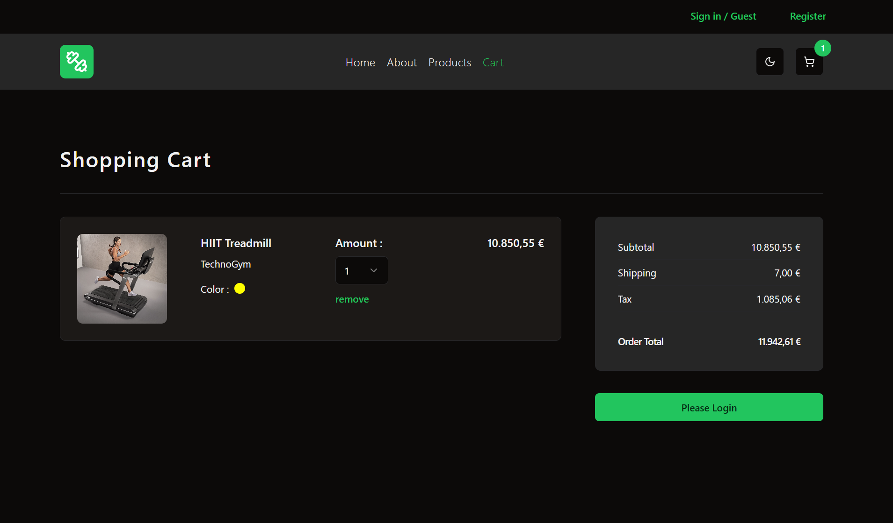

# TS Store Frontend (React + TypeScript + Redux toolkit + Vite)

This project is a work in progress. It's a TypeScript-based store built with React, TypeScript, styled using Shadcn UI, and manages state using Redux Toolkit.

## Technologies Used

- **React:** For building the user interface.
- **Redux Toolkit:** For state management.
- **Axios:** For handling HTTP requests and communicating with APIs.
- **Shadcn UI:** UI component library built on top of Radix UI and Tailwind CSS for beautiful responsive UI components.

## Getting Started

1. Clone the repository.
2. Run `npm install` to install dependencies.
3. Run `npm run dev` to start the development server.

## UI Screenshots

### Landing Page

  

### Products

  

### Register

  

### Shopping Cart

  

